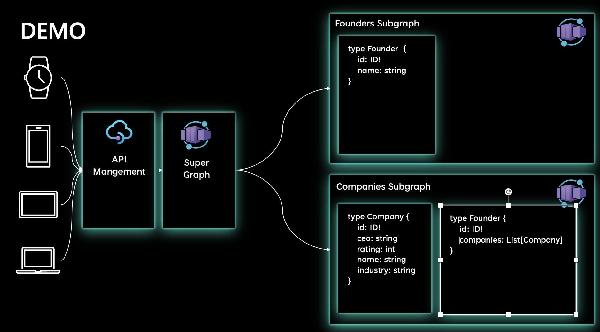
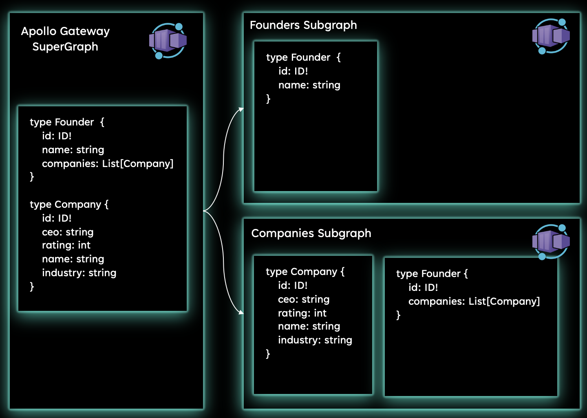

# How to increase developer velocity with Federated Graphql

Many companies are modernizing their applications by transition to GraphQL (a query language for your API), most noteably, Netflix, Facebook, Github and Paypal. This repository explains some of the benefits of (federated) GraphQL and provides a deployable federated GraphQL application for consumers to use.

## Learning outcomes

- GraphQL + Federated GraphQL summary
- How to deploy a federated GraphQL endpoint to Azure and expose it through APIM

## Overview

The fictional company MicroCrunch provides information about organizations and founders.
Their customerbase exists of recruitment agencies using the API for finding suitable candidates to fill C-level roles, founders for discovering/finding co-founders which augment their capabilities and investors to find interesting investments. They have set out to provide the consumer of the API with the best developer experience possible. As such, they want to provide an API in which discoverability (i.e. you don't know what you are looking for, but you are exploring what is out there), search (you know what you are looking for and try to find it) and adaptability (different consumers can use the API based on their needs) is prioritized. As a result, they have decided to use (Federated) GraphQL to provide a single endpoint for consumers to retrieve, explore and create the data they need, while leaving development teams with the service isolation and flexibility.

## Directory Structure

```
.
├── deployment
│   ├── apps
│   └── infra
└── src
    ├── companies
    ├── founders
    └── gateway

```

- deployment: Contains code for deploying the application to Azure
  - apps: builds the docker images and uploads to Azure container registry (ACR), deploys the container apps (i.e. Gateway, Companies and founders) and uploads the graphql schema to API Management
  - infra: Deploys main services to Azure (i.e. API management, Azure Container Apps environment and Container registry).
- src: contains the application code
  - companies: Subgraph (i.e. GraphQL without federation capabilities) with information about companies
  - founders: Subgraph (i.e. GraphQL without federation capabilities) with information about founders
  - gateway: Apollo Gateway responsible for schema stitching.

Recommended files to have a look at:

- [companies/schemas.py](./src/companies/schemas.py): note the `@strawberry.federation.field` and `@strawberry.federation.type`. This tells the GraphQL instance that this model already exists and the functionality should be extended (hence the keyword `extend=True`).

## GraphQL + Federated GraphQL summary

[GraphQL](https://graphql.org/) is a query language which provides a wide range of benefits. It enables developers with an easy way to discover, search for and retrieve the data needed for their usecases. This is achieved through:

- Introspection: Provide information about your API by inspecting the Graph itself.
- Retrieval: Retrieve exactly what you need and nothing more. In addition, the query reflects the response
- Evolve: Modify APIs over time without versioning

Federated GraphQL takes it a step further by introducing [netflix-blogpost](https://netflixtechblog.com/how-netflix-scales-its-api-with-graphql-federation-part-1-ae3557c187e2):

- separation of concerns across domains by enabling entity extension and schema stitching.
- creation of a supergraph from multiple subgraphs provided through a unified API for consumers while also giving backend developers flexibility and service isolation.

## Application Overview

Once you have deployed the application, your application context map will look as follows:

We deploy our application to Azure and leverage two services (to run this application locally with docker-compose, see [running this demo locally](#running-this-demo-locally)):

- [Azure API Management](https://azure.microsoft.com/en-us/services/api-management/#overview)
- [Azure Container Apps](https://azure.microsoft.com/en-us/services/container-apps/)

API Management is optional, but provides extensive capabilities for managing your application lifecycle end-to-end. Azure container apps is required and is our serverless runtime environment to which we deploy our containerized workloads.

### Schema stitching and domain boundaries

One of the benefits of federated GraphQL is schema stitching, which facilitates domain boundaries and service isolation. To understand why, lets use the application context map. We have two domains: Founders and Companies. Each domain provides a set of functionality to its API consumers. However, the Founders domain just thought of a new usecase for their API consumers, we want to provide all the companies created by founders. Originally, there were two options:

1. Let the consumer make separate calls to both APIs and handling the integration on the client (increases complexity, which violates one of our promises --> ease of use/developer experience)
2. Make an API call to the Company domain/api and provide the additional information through the Profile API to the API consumers. However, this results in single usecase functionality and makes it dependent on the Company API.

With federated GraphQL, we resolve these challenges. We enable the Company Graph to extend our classes and provide additional functionality to the consumer. This is done through schema stitching which is provided by the [Federated GraphQL Gateway](https://www.apollographql.com/docs/federation/) resulting in: 

## Running this demo locally

change to the folder containing the [docker-compose.yml](./src/docker-compose.yml) file. Run `docker-compose build` and `docker-compose up`, respectively.

go to http://localhost:4000 and insert the following query:

```
{
  founders(whereNameIs:"Satya Nadella"){
    name
    companies {
      name
      industry
    }
  }
}

```

## Deploying this application to Azure

1. Create a resource group:
   `az group create --name <resource-group-name> --location <location>` and add your resource group name to line 7 in [pipeline.yml](./.github/workflows/pipeline.yml)

2. create a service-principal and add the content of this command as a secret in your github
   repository called AZURE_CREDENTIALS

```
az ad sp create-for-rbac --name "graphql-azure" --role contributor \
    --scopes /subscriptions/<subscription-id>/resourceGroups/<group-name>/ \
    --sdk-auth
```

3. push your code and validate the CICD pipeline succesfully deployed the application.
4. Explore your resource group and all the services in it, test some things out, try to get an understanding of how all the building blocks interact and be fascinated by the capabilities of (federated) GraphQL.
